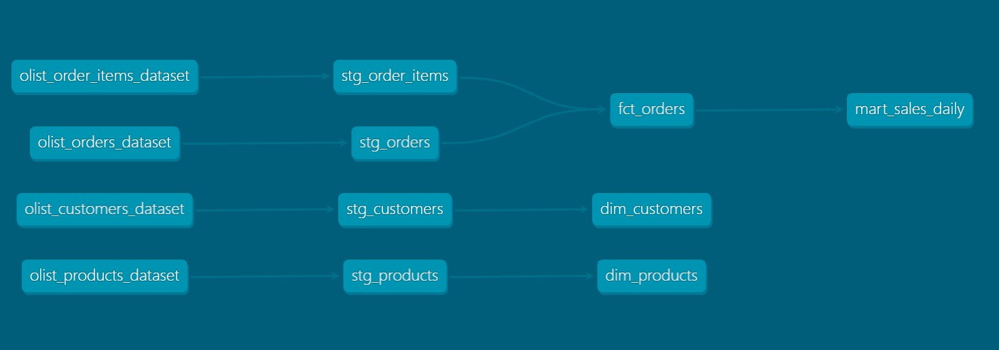

# dbt Olist E-commerce Analytics Project

This project is a small dbt pipeline built on the Brazilian E-Commerce Public Dataset (Olist).

The goal of the project is to transform raw e-commerce data into analytics-ready models using dbt.

## Tech Stack

- dbt Core
- DuckDB
- SQL
- Kaggle Olist Dataset

## Project Structure

The project follows a typical dbt layered architecture:

raw data (CSV seeds)
↓
staging models (views)
↓
marts (tables)
↓
analytics mart

## Models

### Staging

- stg_orders
- stg_customers
- stg_order_items
- stg_products

These models clean and standardize raw data.

### Marts

- fct_orders
- dim_products
- dim_customers
- mart_sales_daily

These models provide analytics-ready datasets.

## Example Analytical Output

The model `mart_sales_daily` provides daily metrics such as:

- number of orders
- total revenue
- freight costs

## Running the Project

Run the following commands:
```
dbt seed 
dbt run
dbt test
dbt docs generate
dbt docs serve
```

## Data Flow
```
olist_orders_dataset
olist_order_items_dataset
olist_customers_dataset
olist_products_dataset
↓
stg_orders
stg_order_items
stg_customers
stg_products
↓
fct_orders
↓
dim_products
dim_customers
↓
mart_sales_daily
```

## Lineage Graph




## Key dbt Concepts Used

- modular SQL models
- ref() dependency graph
- staging → marts architecture
- data quality tests (not_null, unique, relationships)
- model materializations (view vs table)

## Dataset

This project uses the Brazilian E-Commerce Public Dataset by Olist from Kaggle.
The dataset contains information about orders, customers, products and sellers
from a Brazilian marketplace.
